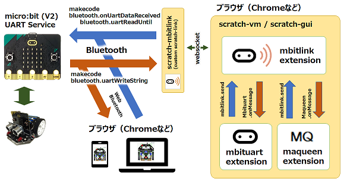
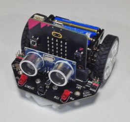
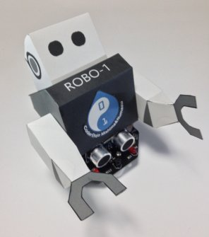

# sc3

- このリポジトリ

	scratch本体の改造、追加部分

- [scratch-mbitlink](https://github.com/marron9999/sc3-mbitlink/blob/master/README_jp.md)

	scratch-linkを改造(BLE UART対応)

- [mbitlink extension](https://github.com/marron9999/sc3-mbitlink/blob/master/README_jp.md)

	bluetooth extensionのBLE部を分離・改造

- [mbituart extension](https://github.com/marron9999/sc3-mbituart/blob/master/README_jp.md)

	bluetooth extensionのGUI部を分離・改造

- [maqueen extension](https://github.com/marron9999/sc3-maqueen/blob/master/README_jp.md)

	MaqueenのGUI部

- [ブラウザ](https://github.com/marron9999/maqueen/blob/master/README_jp.md)

	Web bluetoothでMaqueenを制御

## 開発環境

- Windows 10 Home 20H2 19042.867 (64bit)
- Chrome 89.0.4389.90（64bit)
- Node.js v14.15.5 (64 bit)
- Visual Studio 2019 Community edition
- git 2.30.1.windows.1 (64 bit)

## maqueen

- DFROBOT micro:Maqueen for micro:bit V4.1
- BBC micro:bit V1.5 / V2

## おまけ

https://www.cube-d.co.jp 
株式会社デジタルキューブさんが公開してくれているペーパークラフトをmaqueenにかぶせてみました！

 
