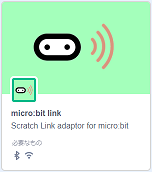
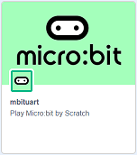
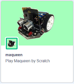

# scratch-desktopへの組み込み

## scratch-desktopのインストール

- https://github.com/llk/scratch-desktop をひらき、リリース 3.20.1 (zip) をダウンロードします。
- ダウンロードしたzipを適当なフォルダ (ここでは C:\sc3\scratch-desktop-3.20.1） に展開します。
- フォルダ (C:\sc3\scratch-desktop-3.20.1） をカレントフォルダにして、npm install またはnpm clean-install で必要なモジュールを組み込みます。
- npm start で scratch desktop が起動したら、次のステップに進んでください。

参考： ls_scratch-desktop-3.20.1.txt : 起動できたときのモジュールリスト (npm list)

## scratch-desktopへの拡張機能の組み込み

- ４つのリポジトリ: sc3、sc3-mbitlink、sc3-mbituart、sc3-maqueen を git clone するか、zipをダウンロードして展開します。
- それぞれの scratch-vm、scratch-gui を、先のフォルダ\node_modules (C:\sc3\scratch-desktop-3.20.1\node_modules） 下にコピーします。
- C:\sc3\scratch-desktop-3.20.1\node_modules\scratch-gui\src\lib\libraries\extensions フォルダを開き、index.jsx.txt を見て、index.jsx を編集・保存します。編集箇所は以下の２つです。

```
import mbitlinkIconURL from './mbitlink/mbitlink_logo.png';
import mbitlinkInsetIconURL from './mbitlink/mbitlink.png';
import mbitlinkSmallIconURL from './mbitlink/mbitlink-40x40.png';

import mbituartIconURL from './mbituart/microbit_logo.png';
import mbituartInsetIconURL from './mbituart/microbit.png';

import maqueenIconURL from './maqueen/maqueen.png';
import maqueenInsetIconURL from './maqueen/maqueen-small.png';
```

```
    {
        name: "micro:bit link",
        extensionId: 'mbitlink',
        iconURL: mbitlinkIconURL,
        insetIconURL: mbitlinkInsetIconURL,
        description: (
            <FormattedMessage
                defaultMessage="Scratch Link adaptor for micro:bit "
                description="Description for the 'mbitlink' extension"
                id="gui.extension.mbitlink.description"
            />
        ),
        featured: true,
        bluetoothRequired: true,
        internetConnectionRequired: true,
        launchPeripheralConnectionFlow: true,
        useAutoScan: false,
        connectionIconURL: microbitConnectionIconURL,
        connectionSmallIconURL: microbitConnectionSmallIconURL,
        connectingMessage: (
            <FormattedMessage
                defaultMessage="Connecting"
                description="Message to help people connect to their micro:bit."
                id="gui.extension.microbit.connectingMessage"
            />
        ),
        helpLink: 'https://scratch.mit.edu/microbit'

    },
    {
        name: (
            <FormattedMessage
                defaultMessage="mbituart"
                description="Name for the 'mbituart' extension"
                id="gui.extension.mbituart.name"
            />
        ),
        extensionId: 'mbituart',
        iconURL: mbituartIconURL,
        insetIconURL: mbituartInsetIconURL,
        description: (
            <FormattedMessage
                defaultMessage="Play Micro:bit by Scratch"
                description="Description for the 'microbituart' extension"
                id="gui.extension.mbituart.description"
            />
        ),
        featured: true
    },
    {
        name: (
            <FormattedMessage
                defaultMessage="maqueen"
                description="Name for the 'maqueen' extension"
                id="gui.extension.maqueen.name"
            />
        ),
        extensionId: 'maqueen',
        iconURL: maqueenIconURL,
        insetIconURL: maqueenInsetIconURL,
        description: (
            <FormattedMessage
                defaultMessage="Play Maqueen by Scratch"
                description="Description for the 'maqueen' extension"
                id="gui.extension.maqueen.description"
            />
        ),
        featured: true
    },
```

- C:\sc3\scratch-desktop-3.20.1\node_modules\scratch-vm\src\extension-support フォルダを開き、extension-manager.js.txt を見て、extension-manager.js を編集・保存します。編集箇所は以下の１つです。

```
    mbitlink: () => require('../extensions/scratch3_mbitlink'),
    mbituart: () => require('../extensions/scratch3_mbituart'),
    maqueen: () => require('../extensions/scratch3_maqueen'),
```

## 「Scratch Link」フォルダへのファイルのコピー

- scratch-link (1.3.67.0) がインストールされていなければ、以下のURLから「Scratch Link」をダウンロードしてインストールしてください。

https://scratch.mit.edu/microbit

- sc3-mbitlinkのフォルダ下にある Scratch-mbitlink.exe を C:\Program Files (x86)\Scratch Link フォルダにコピーします。
- コピーした Scratch-mbitlink.exe を起動します。

## micro:bitへのプログラムの転送

- リポジトリ: mbitlink_hex を git clone するか、zipをダウンロードして展開します。
- v2/microbit-ble_maqeen_v2.hex を micro:bit V2 に転送します。

## scratch-desktop の起動と確認

- フォルダ(C:\sc3\scratch-desktop-3.20.1）をカレントフォルダにして、npm start で scratch desktopを起動します。
- 左下の拡張機能をクリックして、一番上に３つの拡張機能: micro:bit link、mbituart、maqueen が表示されたらOKです。

  

- micro:bitのセンサーを使う場合は
	- micro:bit link を組み込み、micro:bitを接続します。
	- mbituart を組み込み、ブロックを並べて動作するか確認します。

- maqueenを使う場合は
	- micro:bit link を組み込み、micro:bitを接続します。
	- maqueen を組み込み、ブロックを並べて動作するか確認します。

## ブラウザ(chrome)からmaqueenを直接操作する

scratch-desktop を使わず、ブラウザ(chrome) から maqueen を直接操作することもできます。

- リポジトリ: maqueen を git clone するか、zipをダウンロードして展開します。
- ブラウザ(chrome)で maqueen.html を開きます。
- 右上の「micro:bit」をクリック/タッチして micro:bit と接続します。
- 画面上のボタンでモーターを動かしたり、LED点灯などをすることができます。

