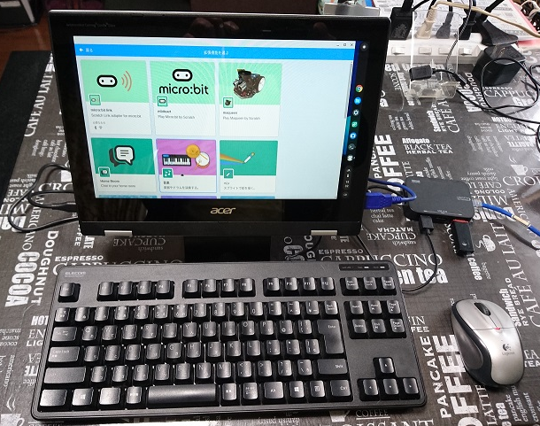
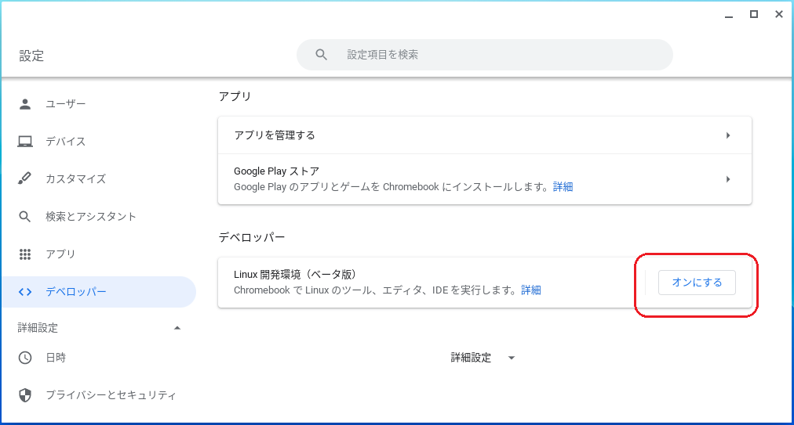
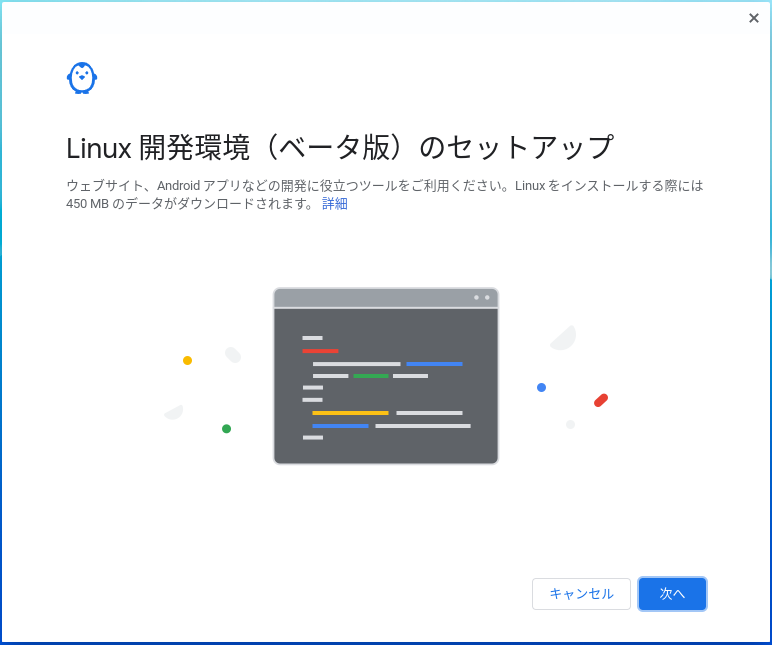
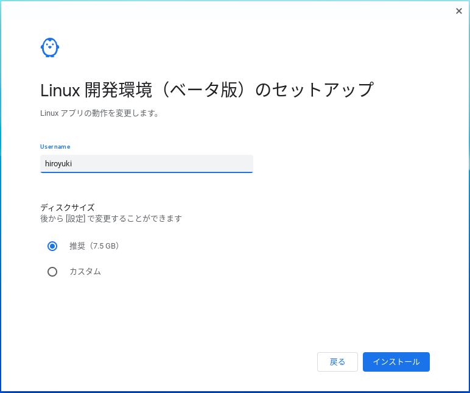
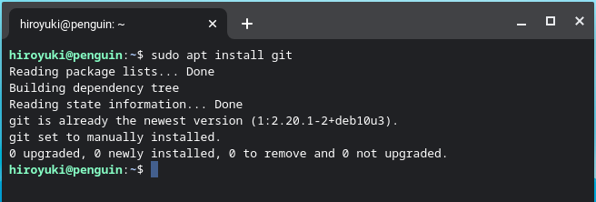
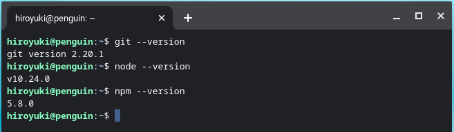
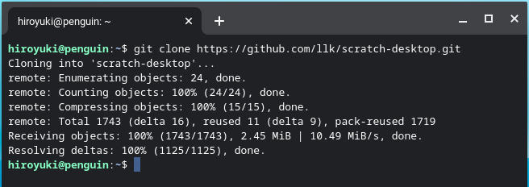
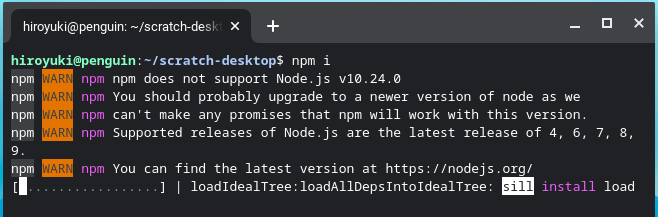
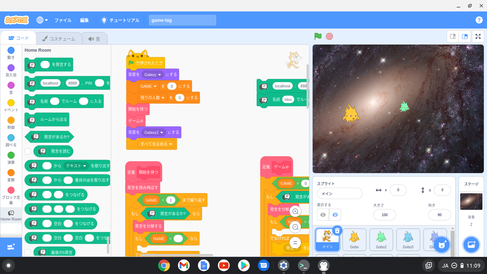
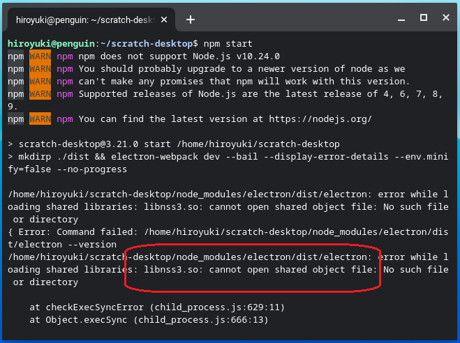

# chromebook (spin 311)でscratch-desktopを動かす

acer chromebook spin 311 (CP311-3H-A14N)<br>
　　　11.6型 WXGA[HD] / MediaTek M8183C / 4GB /<br>
　　　32GB eMMC / 1.05kg / 日本語KB
https://acerjapan.com/notebook/chromebook/spin311/


参考）本体KBのReturnキーが使いにくいので、<br>
　　　USB2.0ポートにUSBハブを付けて外付KB、MOUSE、
有線LANを使いました。

## (1) scratch-desktopを動かすためにlinux環境をインストールします





Username の部分は、自分の名前を入れます



## (2) linux環境ができたら、必要なソフトウェアをインストールします

### (2-1) gitをインストールします



### (2-2) node.jsも同じようにインストールします

```
sudo apt install nodejs
````

「npmがないよ」といわれたらnpmもインストールします

```
sudo apt install npm
````

### (2-3) 参考：この記事を書いたときのgit、node.jsのバージョン



## (3) githubからscratch-desktopをcloneします



## (4) `npm i` で必要なパッケージを組み込みます



## (5) `npm start` でscratch-desktopを動かします



## (6) `npm start` でエラーが出た？



「libnss3.soがない」というエラーがでたらaptでインストールしてください

```
sudo apt install libnss3
```

## (7) scratch-desktopの初期表示が英語？

linux環境のデフォルト言語が英語：en_USによるものです

インターネット上に日本語（ロケール）「ja_JP」をインストールする記事があるので、参考にしてインストールします

例) https://qiita.com/libra_lt/items/feb65b1742d9508740a9

```
localedef -i /usr/share/i18n/locales/ja_JP -f UTF-8 /usr/lib/locale/ja_JP.UTF-8
localedef --add-to-archive /usr/lib/locale/ja_JP.UTF-8
localectl set-locale LANG=ja_JP.UTF-8
```

日本語「ja_JP」がインストールできたら、`vi .bashrc` でテキストエディタを開き、最後に `LANG=ja_JP.UTF-8` を設定し、`:`  `w!` で書き込み、`:` `q` で終了します

`exit`でlinux環境を終了させ、再度、linux環境を動かし、`npm start`でscratch-desktopを動かします
