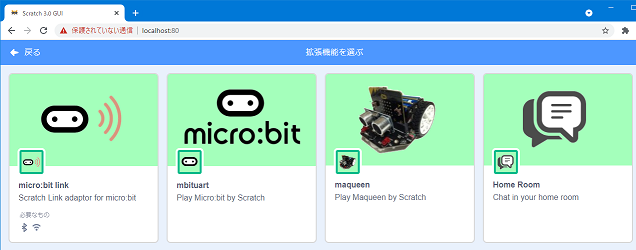

# My Scratch 3.0 を作る（その1）

- その1：scratch-gui をインストールする
- [その2](./my-sc3_2.md)：scratch-gui をカスタマイズする
- [その3](./my-sc3_3.md)：httpsで起動できるようにする
- [その4](./my-sc3_4.md)：httpsで使う自己証明書を作る
- [その5](./my-sc3_5.md)：参考）chromebookでの認証局の取り込み
- [その6](./my-sc3_6.md)：参考）\[WIN\] nginxでサーバーを統合する
- [その7](./my-sc3_7.md)：参考）\[Linux\] nginxでサーバーを統合する

<hr>

※ Windows前提（linuxもほぼ同様）<br>
※ ここで「`c:\scratch-gui`」に構築するように記述しています。

<hr>

## 1-1 scratch-gui 環境を作る

githubから「scratch-gui」をダウンロードします。

【windows】

```
cd /d C:\
git clone https://github.com/llk/scratch-gui.git
```

【linux】

```
cd  ~
git clone https://github.com/llk/scratch-gui.git
```

必要なパッケージを組み込みます。

```
cd C:\scratch-gui
npm install
```

動くかテストします。

```
npm start
```

chromeで `http://localhost:8601` を開きます。

<hr>

## 1-2 拡張機能を組み込む

必要な拡張機能、拡張資材をダウンロードします。

【windows】 

```
md /d C:\sc3
cd /d c:\sc3
git clone https://github.com/marron9999/sc3.git
git clone https://github.com/marron9999/sc3-mbitlink.git
git clone https://github.com/marron9999/sc3-mbituart.git
git clone https://github.com/marron9999/sc3-maqueen.git
git clone https://github.com/marron9999/sc3-homeroom.git
git clone https://github.com/marron9999/homeroom.git
```

【linux】 

```
cd  ~
git clone https://github.com/marron9999/sc3.git
git clone https://github.com/marron9999/sc3-mbitlink.git
git clone https://github.com/marron9999/sc3-mbituart.git
git clone https://github.com/marron9999/sc3-maqueen.git
git clone https://github.com/marron9999/sc3-homeroom.git
git clone https://github.com/marron9999/homeroom.git
```

【windows】 xcopyコマンドで拡張機能を組み込みます。

```
cd /d c:\scratch-gui

xcopy c:\sc3\sc3\scratch-gui\*.* . /f /y /e
xcopy c:\sc3\sc3-mbitlink\scratch-gui\*.* . /f /y /e
xcopy c:\sc3\sc3-mbituart\scratch-gui\*.* . /f /y /e
xcopy c:\sc3\sc3-maqueen\scratch-gui\*.* . /f /y /e
xcopy c:\sc3\sc3-homeroom\scratch-gui\*.* . /f /y /e

xcopy c:\sc3\sc3\scratch-vm\*.* node_modules\scratch-vm /f /y /e
xcopy c:\sc3\sc3-mbitlink\scratch-vm\*.* node_modules\scratch-vm /f /y /e
xcopy c:\sc3\sc3-mbituart\scratch-vm\*.* node_modules\scratch-vm /f /y /e
xcopy c:\sc3\sc3-maqueen\scratch-vm\*.* node_modules\scratch-vm /f /y /e
xcopy c:\sc3\sc3-homeroom\scratch-vm\*.* node_modules\scratch-vm /f /y /e
```

【linux】 cpコマンドで拡張機能を組み込みます。

```
cd ~

cp -r -f -v sc3/scratch-gui .
cp -r -f -v sc3-mbitlink/scratch-gui .
cp -r -f -v sc3-mbituart/scratch-gui .
cp -r -f -v sc3-maqueen/scratch-gui .
cp -r -f -v sc3-homeroom/scratch-gui .

cp -r -f -v sc3/scratch-vm scratch-gui/node_modules
cp -r -f -v sc3-mbitlink/scratch-vm scratch-gui/node_modules
cp -r -f -v sc3-mbituart/scratch-vm scratch-gui/node_modules
cp -r -f -v sc3-maqueen/scratch-vm scratch-gui/node_modules
cp -r -f -v sc3-homeroom/scratch-vm scratch-gui/node_modules
```

<hr>

## 1-2-1 拡張機能を組み込む

※ 以降で明にフルパスで記述されていないパスは、<br>
※ 「`C:\scratch-gui`」を基準としています。

※ マージ作業には、<br>
※ windowsだと`winmerge`ツール、<br>
※ linuxだと`meld`ツールを使うと、楽にできます。

- `src\lib\libraries\extensions` フォルダを開き、`index.jsx.txt` に記述されているマージ箇所を `index.jsx` に組み込み保存します。<br>
マージ箇所は「`//{{`」と「`//}}`」で囲まれた場所です。

- `index.jsx.hr.txt` に記述されているマージ箇所を、`index.jsx` に組み込み（上記のマージ位置の後ろ）保存します。

- `node_modules\scratch-vm\src\extension-support` フォルダを開き、`extension-manager.js.txt` に記述されているマージ箇所を `extension-manager.js` に組み込み保存します。

- `extension-manager.js.hr.txt` に記述されているマージ箇所を `extension-manager.js` に組み込み（上記のマージ位置の後ろ）保存します。

<hr>

## 1-2-2 拡張機能が組み込めるか試す

```
cd C:\scratch-gui
npm start
```

chromeで `http://localhost:8601` を開きます。



<hr>

※ [その2](./my-sc3_2.md)に続く
