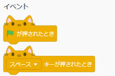
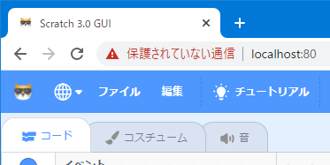
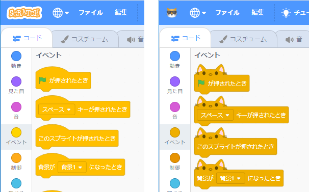
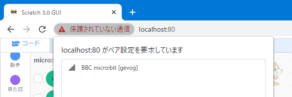

# My Scratch 3.0 を作る（その2）

- [その1](./my-sc3_1.md)：scratch-gui をインストールする
- その2：scratch-gui をカスタマイズする
- [その3](./my-sc3_3.md)：httpsで起動できるようにする
- [その4](./my-sc3_4.md)：httpsで使う自己証明書を作る
- [その5](./my-sc3_5.md)：参考）chromebookでの認証局の取り込み
- [その6](./my-sc3_6.md)：参考）\[WIN\] nginxでサーバーを統合する
- [その7](./my-sc3_7.md)：参考）\[Linux\] nginxでサーバーを統合する
- [その8](./my-sc3_8.md)：おまけ）インターネット上のイメージ等を使わないようにする

## 2-1 イベントブロック等の形状を「ネコ」キャラに変更する

- `C:\sc3\sc3\my-scratch\scratch-blocks.zip` を開き、6つのjsファイル（`*compressed*.js`）を `node_modules\scratch-blocks` フォルダにコビー（上書き）します。

## 2-2 My Scratchのアイコンを変更する

その1でコピーしたアイコン（オリジナルイメージファイルは`src\components\coming-soon\cool-cat.png`）に変更します。

- `src\components\menu-bar` フォルダを開き

	- `menu-bar.jsx.txt` に記述されているマージ箇所を `menu-bar.jsx` に組み込み保存します。

## 2-3 メニューバーの不要なメニューを消す

- `src\playground` フォルダを開き

	- `index.ejs.txt` に記述されているマージ箇所を index.ejs に組み込み保存します。
	- `render-gui.jsx.txt` に記述されているマージ箇所を `render-gui.jsx` に組み込み保存します。

## 2-4 見にくい黄色ブロックの色を調整する

- `src\lib` フォルダを開き

	- `make-toolbox-xml.js.txt` に記述されているマージ箇所を `make-toolbox-xml.js` に組み込み保存します。 
マージ箇所は「`<!-- {{ -->`」と「`<!-- }} -->`」で囲まれた場所です。

- `src\containers` フォルダを開き

	- `blocks.jsx.txt` に記述されているマージ箇所を `blocks.jsx` に組み込み保存します。

【カスタマイズ前】　　　　　　　　　　　　【カスタマイズ後】
    

## 2-5 ScratchでWeb-Bluetoothを使えるようにする

- `src/containers` フォルダを開き

	- `gui.jsx.txt` に記述されているマージ箇所を `gui.jsx` に組み込み保存します。

- `node_modules\scratch-vm\src` フォルダを開き

	- `virtual-machine.js.txt` に記述されているマージ箇所を `virtual-machine.js` に組み込み保存します。

- `node_modules\scratch-vm\src\engine` フォルダを開き

	- `runtime.js.txt` に記述されているマージ箇所を `runtime.js` に組み込み保存します。

- `node_modules\scratch-vm\src\io` フォルダを開き

	- `ble.js.txt` に記述されているマージ箇所を `ble.js` に組み込み保存します。

## 2-6 node_modules他の不具合っぽい現象を修正する

- `node_modules\webpack-dev-server\client\utils` フォルダを開き

	- `C:\sc3\sc3\my-scratch\createSocketUrl.js.txt` に記述されている修正箇所（`//{{`と`//}}`で示された箇所）を `createSocketUrl.js` に組み込み保存します。

- `node_modules\scratch-audio\src` フォルダを開き

	- `C:\sc3\sc3\my-scratch\AudioEngine.js.txt` に記述されている修正箇所（`//{{`と`//}}`で示された箇所）を `AudioEngine.js` に組み込み保存します。

※ （[その3](./my-sc3_3.md)）に続く