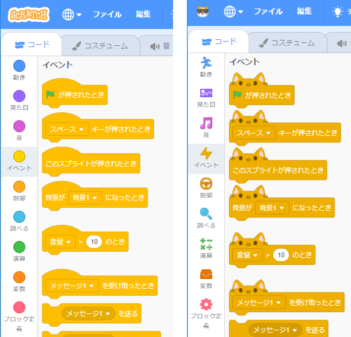

# My Scratch 3.0 を作る（その2）

## 2-1 イベントブロック等の形状を「ネコ」キャラに変更する

- `C:\sc3\sc3\my-scratch\scratch-blocks.zip` を開き、6つのjsファイル（`*compressed*.js`）を `node_modules\scratch-blocks` フォルダにコビー（上書き）します。

## 2-2 My Scratchのアイコンを変更する

その1でコピーしたアイコン（オリジナルイメージファイルは`src\components\coming-soon\cool-cat.png`）に変更します。

- `src\components\menu-bar` フォルダを開き、`menu-bar.jsx.txt` に記述されているマージ箇所を `menu-bar.jsx` に組み込み保存します。

## 2-3 メニューバーの不要なメニューを消す

- `src\playground` フォルダを開き、`index.ejs.txt` に記述されているマージ箇所を index.ejs に組み込み保存します。

- `src\playground` フォルダを開き、`render-gui.jsx.txt` に記述されているマージ箇所を `render-gui.jsxI` に組み込み保存します。

## 2-4 見にくい黄色ブロックの色を調整する

- `src\lib` フォルダを開き、`make-toolbox-xml.js.txt` に記述されているマージ箇所を `make-toolbox-xml.js` に組み込み保存します。 
マージ箇所は「`<!-- {{ -->`」と「`<!-- }} -->`」で囲まれた場所です。

- `src\containers` フォルダを開き、`blocks.jsx.txt` に記述されているマージ箇所を `blocks.jsx` に組み込み保存します。

【カスタマイズ前】　　　　　　　　　　　　【カスタマイズ後】
    

## 2-5 ScratchでWeb-Bluetoothを使えるようにする

- `src/containers` フォルダを開き、`gui.jsx.txt` に記述されているマージ箇所を `gui.jsx` に組み込み保存します。

- `node_modules\scratch-vm\src` フォルダを開き、`virtual-machine.js.txt` に記述されているマージ箇所を `virtual-machine.js` に組み込み保存します。

- `node_modules\scratch-vm\src\engine` フォルダを開き、`runtime.js.txt` に記述されているマージ箇所を `runtime.js` に組み込み保存します。

- `node_modules\scratch-vm\src\io` フォルダを開き、`ble.js.txt` に記述されているマージ箇所を `ble.js` に組み込み保存します。

※ （その3）に続く
