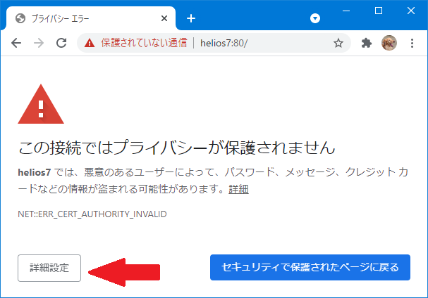
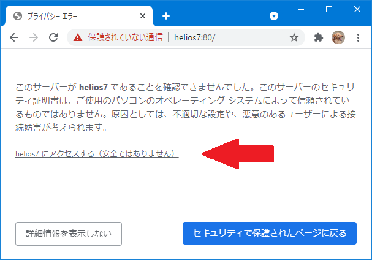

# My Scratch 3.0 を作る（その3）

## 3-1 scratch-guiをhttpsで起動できるようにする

- `webpack.config.js.txt` に記述されているマージ箇所を `webpack.config.js` に組み込み保存します。

## 3-2 起動用バッチを作る

例）【windows】 `server.bat`

```
cd /d c:\scratch-gui
set PORT=80
set NODE_BLE=webbluetooth
npm start
```

例）【linux】 `server.sh`

```
#!/bin/bash
cd ~/scratch-gui
export PORT=80
export NODE_BLE=webbluetooth
npm start
```

## 3-3 chromeで My Scratch 3.0 を開く

(1) 「3-1」の修正を実施している場合

起動用バッチを起動し、chromeで `https://localhost` を開きます。

- 別PCでscratch-guiを起動した場合は、<br>
`https://マシン名` または `https://IPアドレス` を開きます。

このとき、証明書の警告がでる場合は、[詳細設定]ボタンをクリックし、[アクセスする]のリンクをクリックします。

- chromeでweb-Bluetoothを使用する場合、リモート接続（localhost以外へのアクセス）で、かつ、httpsでのアクセスが必要になりますが、今回の設定では「証明書」を用意していないため、「CERT_AUTHORITY_INVALID」のエラーがでます。

- chromeでweb-Bluetoothを使用するが、localhostでしかアクセスしない場合は、「3-1」の修正は不要です。(2)の方法で開いてください。





(2) 「3-2」の修正を実施している場合

起動用バッチを起動し、chromeで `http://localhost` を開きます。

- 別PCでscratch-guiを起動した場合は、<br>
`http://マシン名` または `http://IPアドレス` を開きます。
