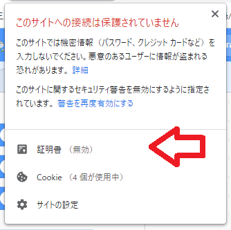
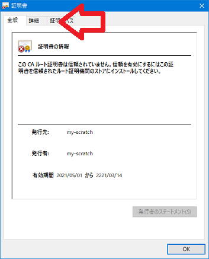
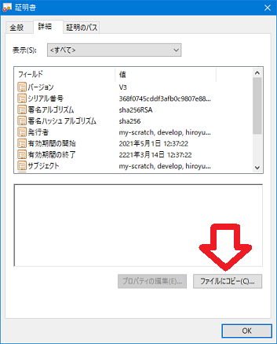
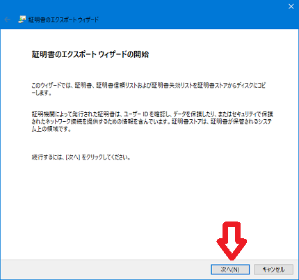
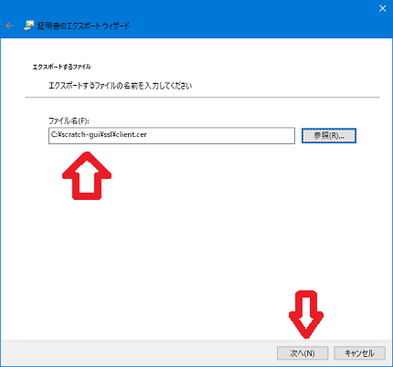
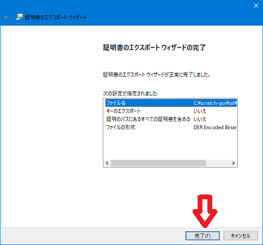

# My Scratch 3.0 を作る（その4）

※ windows下の操作を前提としています

## 4-1 httpsで使う自己証明を作る

- opensslが使える状態で、以下のコマンドを実行します。<br>
「`set`」でしている値は、事前に変更してください。

```
cd /d c:\scratch-gui\ssl
make-cer.bat
```

## 4-2 scratch-guiを自己証明付きで起動できるようにする

- `webpack.config.js.cert.txt` に記述されているマージ箇所を `webpack.config.js` に組み込み保存します。

## 4-3 chromeで Scratch を開く

起動用バッチを起動し、chromeで `https://localhost` を開きます。

- 別PCでscratch-guiを起動した場合は、<br>
`https://マシン名` または `https://IPアドレス` を開きます。

このとき、証明書の警告がでたら、[詳細設定]ボタンをクリックし、[アクセスする]のリンクをクリックします。

## 4-4 クライアント（ブラウザ）に組み込む証明を作る

- 「保護されていない通信」部分をマウスで右クリックし、「証明書（無効）」ヲクリックします。

    

- 「詳細」タブをクリックし、「ファイルにコピー」をクリックします。

    　

- ウイザードの開始で「次へ」をクリックし、「DER encoded binary X.509」を選択して「次へ」をクリックします。

    　

- 出力先のフルパス名を指定して「次へ」をクリックし、次の画面で「完了」をクリックします。

    　

- 「正しくエクスポートされました」が表示されたら、ブラウザを一度閉じます。

    

※ （その5）に続く
