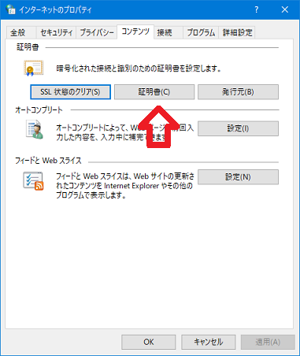
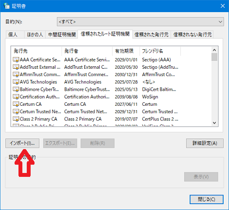
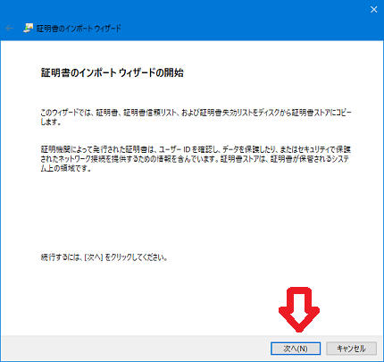
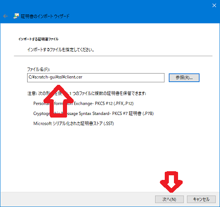
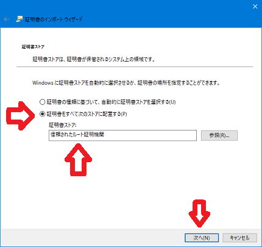
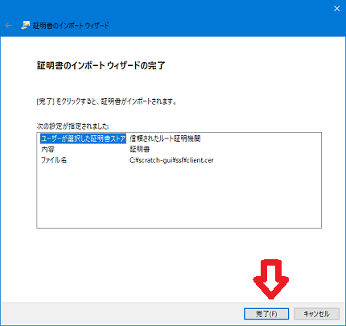
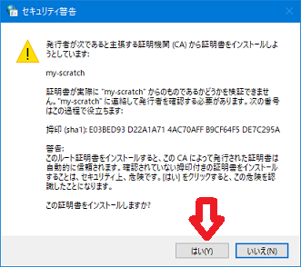
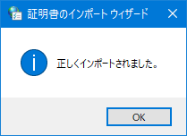
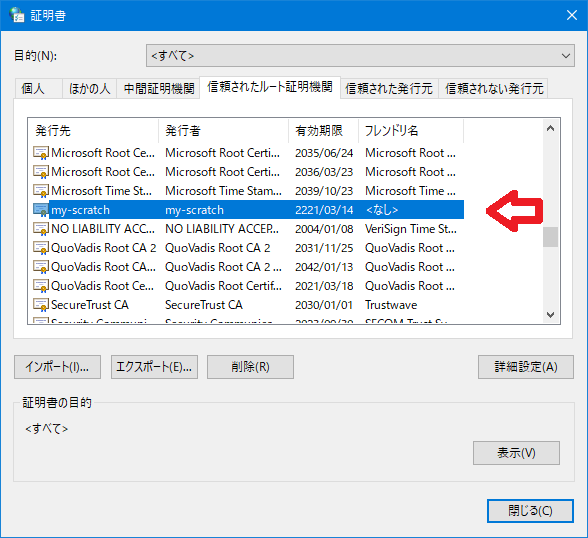

# My Scratch 3.0 を作る（その4）

- [その1](./my-sc3_1.md)：scratch-gui をインストールする
- [その2](./my-sc3_2.md)：scratch-gui をカスタマイズする
- [その3](./my-sc3_3.md)：httpsで起動できるようにする
- その4：httpsで使う自己証明書を作る
- [その5](./my-sc3_5.md)：参考）chromebookでの認証局の取り込み
- [その6](./my-sc3_6.md)：参考）\[WIN\] nginxでサーバーを統合する
- [その7](./my-sc3_7.md)：参考）\[Linux\] nginxでサーバーを統合する

<hr>

## 4-1 httpsで使う自己証明書を作る

- `make-set.bat`内に記述されている「`set`」の値は、ご自身の環境の合わせて事前に変更してください。<br>
特に、「`HN`」、「`IP`」にはscratch-guiを動かすPCの名前とIPアドレスを記述してください。

    【make-set.bat】

    ```
    set C=JP
    set ST=shizuoka
    set L=numazu
    set O=hiroyuki
    set OU=develop
    set CN=my-scratch

    set HN=helios7
    set IP=192.168.116.65

    rem set DES3=-des3
    set DES3=
    ```

- opensslが使える状態で、以下のコマンドを実行します。<br>
`make-ca.bat`でプライベート認証局、中間認証局を作ります。<br>
`make-cer.bat`でサーバー証明書を作ります。

    ```
    cd /d c:\scratch-gui\ssl
    make-ca.bat
    make-cer.bat
    ```

<hr>

## 4-2 scratch-guiを証明書付きで起動する

- `webpack.config.js.cert.txt` に記述されているマージ箇所を `webpack.config.js` に組み込み保存します。

- 起動用バッチで、scratch-guiを起動します。

<hr>

## 4-3 クライアント（ブラウザ）に作ったプライベート認証局をシステムに取り込む

- コントロールパネルの「インターネットオプション」を開き、「証明書」をクリックし、「インポート」をクリックします。

    　

- ウイザードの開始で「次へ」をクリックし、4-1で作ったプライベート認証局(`ca.pem`または`ca.pem.cer`)のフルパス名を指定し「次へ」をクリックします。

    　

- 「証明書をすべて次のストアに配置する」を選択し、「信頼されたルート証明機関」を指定し、「次へ」をクリックし、次の画面で「完了」をクリックします。

    　

- 「セキュリティ警告」で「はい」をクリックし、「正しくインポートされました」が表示されたら、インポートは終わりです。

    　

- 証明書の一覧にインポートした証明書が表示されていることを確認して終わりです。

    

<hr>

## 4-4 chromeで Scratch を開く

chromeで `https://localhost` を開きます。<br>
このとき、証明書の警告がでないことを確認します。


<hr>

※ 参考）[その5](./my-sc3_5.md)：chromebookでの認証局の取り込み

※ （[その6](./my-sc3_6.md)）に続く
