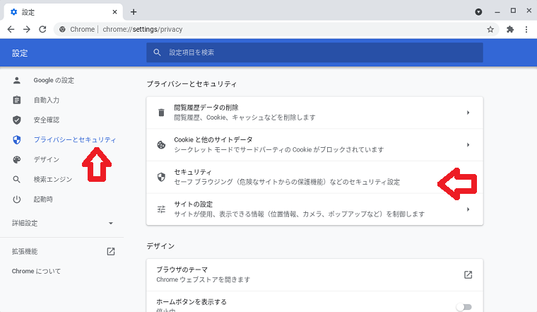
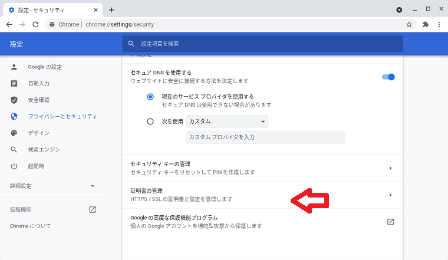
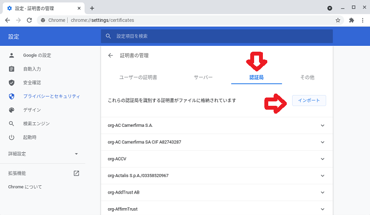
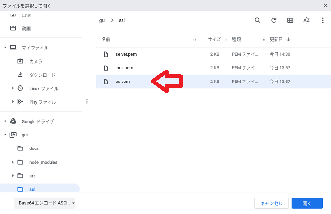
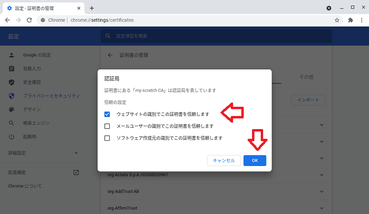
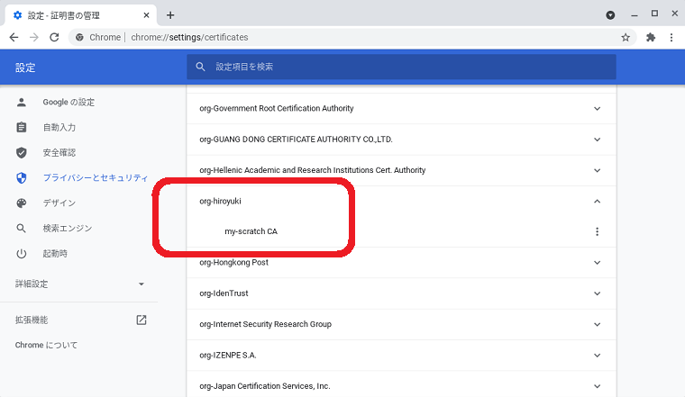
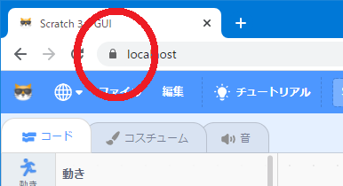

# My Scratch 3.0 を作る（その5）

※ chromebookでの操作を前提としています

## chromeに作ったプライベート認証局をシステムに取り込む

- 「設定」から「プライバシーとセキュリティ」をクリックし、「セキュリティ」をクリックします。

    
    
- 「証明書の管理」をクリックします。

    

- 「認証局」をクリックし、「インポート」をクリックします。

    

- 4-1で作ったプライベート認証局(`ca.pem`または`ca.pem.cer`)を選択し「開く」をクリックします。

    

- 「ウェブサイトの識別でこの証明書を信頼します」をチェックし、「OK」をクリックします。

    

- 認証局の一覧にインポートした証明書が表示されていることを確認して終わりです。

    

## 4-4 chromeで Scratch を開く

chromeで `https://localhost` を開きます。 
このとき、証明書の警告がでないことを確認します。

※ 参考）その5：chromebookでのプライベート認証局の取り込み
