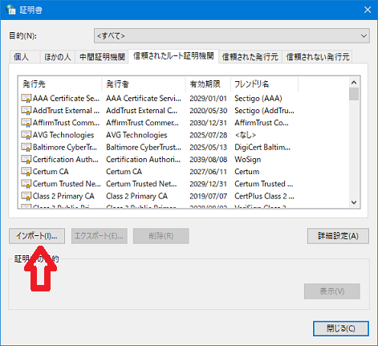
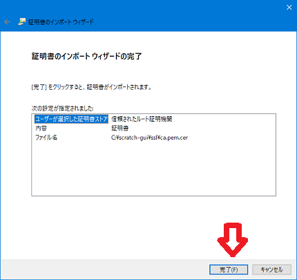
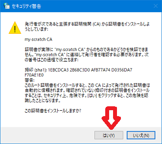
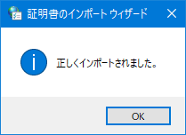
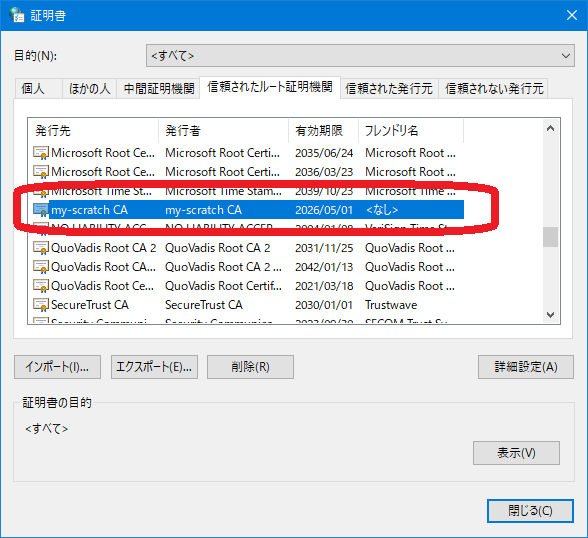

# My Scratch 3.0 を作る（その5）

※ windows下の操作を前提としています

## 5-1 クライアント（ブラウザ）に作った証明書をシステムに取り込む

- コントロールパネルの「インターネットオプション」を開き、「証明書」をクリックし、「インポート」をクリックします。

    　

- ウイザードの開始で「次へ」をクリックし、4-4で出力した証明書のフルパス名を指定し「次へ」をクリックします。

    　

- 「証明書をすべて次のストアに配置する」を選択し、「信頼されたルート証明機関」を指定し、「次へ」をクリックし、次の画面で「完了」をクリックします。

    　

- 「セキュリティ警告」で「はい」をクリックし、「正しくインポートされました」が表示されたら、インポートは終わりです。

    　

- 証明書の一覧にインポートした証明書が表示されていることを確認して終わりです。

    

## 5-2 chromeで Scratch を開く

chromeで `https://localhost` を開きます。 
このとき、証明書の警告がでないことを確認します。

